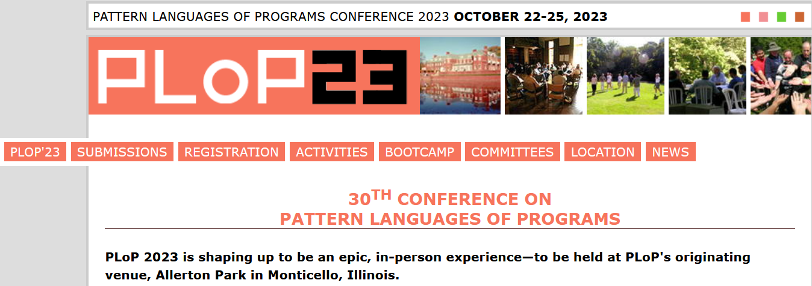

<!-- ## US Pattern Languages of Programs (PLoP) -->

*Next edition:* [PLoP 2023](https://hillside.net/plop/2023/)

 
[Past conferences](https://hillside.net/index.php/past-plop-conferences) (with PDFs of published papers):

  * PLoP 2022: [website](https://hillside.net/plop/2022/), [papers](https://hillside.net/plop/2022/index.php?nav=program) <!-- note: https://hillside.net/plop/2022/papers/proceedings/ exists but contains 2018 proceedings -->
  * PLoP 2021: [website](https://hillside.net/plop/2021/), [papers](https://hillside.net/plop/2021/index.php?nav=program) <!-- note: https://hillside.net/plop/2021/papers/proceedings/ exists but contains 2018 proceedings --> 
  * PLoP 2020: [website](https://hillside.net/plop/2020/), [proceedings](https://hillside.net/plop/2020/papers/proceedings/) 
  * PLoP 2019: [website](https://hillside.net/plop/2019/), [proceedings](https://hillside.net/plop/2019/papers/proceedings/) 
  * PLoP 2018: [website](https://hillside.net/plop/2018/), [proceedings](https://hillside.net/plop/2018/papers/proceedings/) 
  * to be continued
